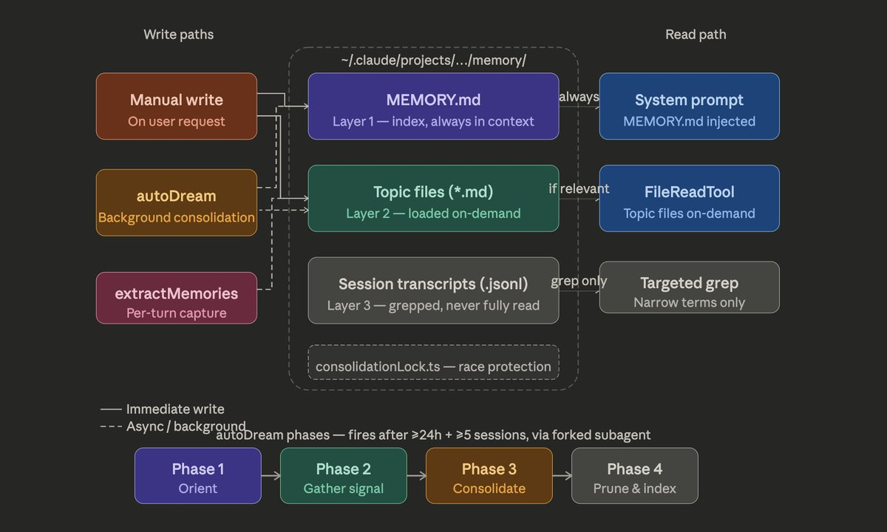

# himanshu (@himanshustwts)

Based on everything explored in the source code, here's the full technical recipe behind Claude Code's memory architecture:

[shared by claude code]

Claude Code’s memory system is actually insanely well-designed. It isn't like  “store everything” but constrained, structured and self-healing memory.

The architecture is doing a few very non-obvious things:

> Memory = index, not storage
+ MEMORY.md is always loaded, but it’s just pointers (~150 chars/line)
+ actual knowledge lives outside, fetched only when needed

> 3-layer design (bandwidth aware)
 + index (always)
 + topic files (on-demand)
+ transcripts (never read, only grep’d)

> Strict write discipline
 +  write to file → then update index
 + never dump content into the index
 +  prevents entropy / context pollution

> Background “memory rewriting” (autoDream)
 +  merges, dedupes, removes contradictions
 +  converts vague → absolute
 +  aggressively prunes
 +  memory is continuously edited, not appended

> Staleness is first-class
 + if memory ≠ reality → memory is wrong
 +  code-derived facts are never stored
 +  index is forcibly truncated

> Isolation matters
 + consolidation runs in a forked subagent
 + limited tools → prevents corruption of main context

> Retrieval is skeptical, not blind
 +  memory is a hint, not truth
 +  model must verify before using

> What they don’t store is the real insight
 +  no debugging logs, no code structure, no PR history
 +  if it’s derivable, don’t persist it

## Media
- 

## Engagement
- 6,316 likes | 696 retweets | 824,632 views
