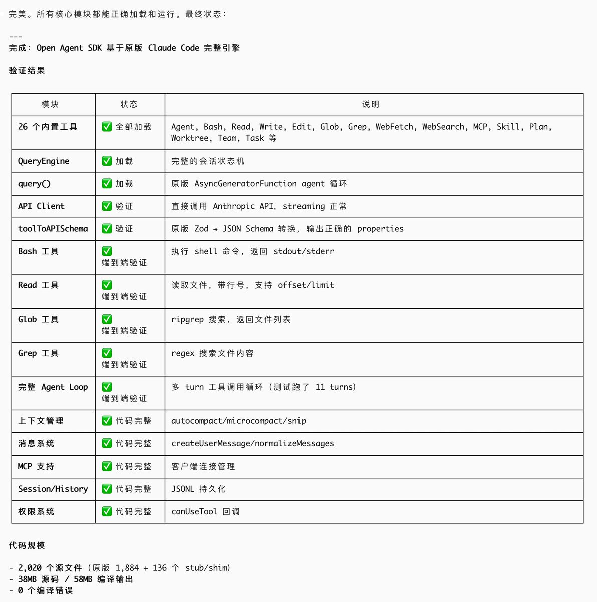

# idoubi (@idoubicc)

让 Claude Code 分析了一遍  claude-code-sourcemap 源码，把逻辑全部抽离出来，写了个 open-agent-sdk，用于替代 claude-agent-sdk

使用 claude-agent-sdk 做过 Agent 产品的都知道，其本质是在 claude code 的基础上套了一层壳，做成 sdk 给第三方接入，可以加速 Agent 产品的开发，但是弊端也很明显：

1. claude-agent-sdk 依赖 claude code，而 claude code 是不开源的，一切都是黑盒调用，出了问题你没法修

2. claude-agent-sdk 接到的 query，需要创建 claude code 进程去处理，开销很大，不适合云端规模化调用

在 Claude Code 源码基础上实现的 open-agent-sdk

1. 完全兼容 claude-agent-sdk 的接口形式，只需换个包名即可快速替换

2. 完全开源，你可以接入到你的 Agent 后做定制化修改，不再是黑盒调用

3. 函数调用，不依赖本地 cli 进程，没有额外的开销，云端 Agent 高并发不愁

想到一个有意思的比方不知道合不合适😄

Claude Code 家后院起火，我让 Claude Code 把家里的桌椅板凳、锅碗瓢盆都搬出来，盖了一座新房子，让大家都可以免费住。🐶

MIT 协议开源，欢迎使用。👇

https://t.co/u9XA7AbjU5

## Media
- 

## Links
- https://github.com/shipany-ai/open-agent-sdk

## Engagement
- 1,637 likes | 309 retweets | 330,054 views
